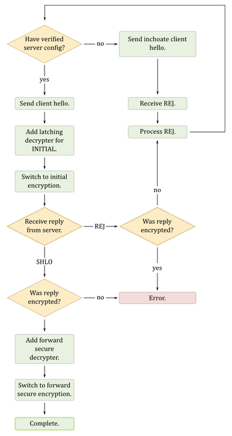

# QUIC Crypto Protocol

Extracts from official __QUIC Crypto__ document:  
[https://docs.google.com/document/d/1g5nIXAIkN_Y-7XJW5K45IblHd_L2f5LTaDUDwvZ5L6g](https://docs.google.com/document/d/1g5nIXAIkN_Y-7XJW5K45IblHd_L2f5LTaDUDwvZ5L6g)

---------------------

## Table of Contents

* [Overview](#overview)
    * [Source-address Token](#token)
    * [Handshake costs](#handshakecosts)
* [Handshake message format](#handshakemessage)
* [Client Handshake](#clienthandshake)
    * [Inchoate Client Hello message (inchoate CHLO)](#chlo)
    * [Rejection message (REJ)](#rej)
        * [Server Config](#scfg)
    * [Full Client Hello message (full CHLO)](#fullchlo)
    * [Server Hello message (SHLO)](#shlo)
* [Key Derivation](#keyderivation)
* [Client Encrypted Tag Values (CETV)](#cetv)
* [Certificate Compression](#certificatecompression)
* [ANNEX A: Tag list](#taglist)
* [ANNEX B: Extracts from RFC5869 - HMAC-based Key Derivation Function (HKDF)](../doc/HKDF.md)

## <A name="overview"></A> Overview

### <A name="token"></A> Source-address Token

The goal of Source-address Token is to handle IP address spoofing: a QUIC Client must proves on each crypto request that it owns  its IP address by sending the Source-address token given by the QUIC Server on each requests.

A QUIC Client must first obtain a valid Token from the server:

* For the client a Source-address Token is just an opaque byte string
* For the server a Source-address Token is an authenticated-encryption block (ex: AES-GCM) created by the server that contains:
    * Client's IP address
    * Token's timestamp

Token duration validation is the responsability of the server:

* source_address_token_future = 3600 seconds (=1h)
* source_address_token_lifetime = 86.400 seconds (=24h)

### <A name="handshakecosts"></A> Handshake cost

In QUIC, the server's preference are fully enumerated and static. They are bundled, along with Diffie-Hellman public values into a "server config". This server config has an expiry and is signed by the server's private key. __Because the server config is static, a signing operation is not needed for each connection__, rather a single signature suffices for many connections.

The keys for a connection are agreed using Diffie-Hellman. The server's Diffie Hellman value is found in the server config and the client provides one in its first handshake message. Because the server config must be kept for some time (several days) in order to allow 0-RTT handshakes (leak risk), immediately upon receiving the connection, the server replies with an ephemeral Diffie-Hellman value and the connection is rekeyed.

The server needs only the following to process QUIC connections:

* The static server config value (server don't need the private key for the certificate)
* The Diffie-Hellman private value

__The private key for the certificate need never be placed on the server.__

A form of short-lived certificates can be implemented by signing short-lived server configs and installing only on those server.

## <A name="handshakemessage"></A> Handshake message format

The crypto protocol consist of arbitrary sized messages send over a dedicated stream in QUIC (__STREAM ID=1__). These messages have a uniform, key-value format.

The keys are opaque 32-bit tags:

* All values are little-endian
* example: '__EXMP__' key --> __0x504d5845__ (little-endian)
* If a tag is written in ASCII but is less than 4 characters then it's as if the remaining characters were NUL:
    * example: '__EXP__' --> __0x505845__
* If the tag value contains bytes outside of the ASCII range, they'll be written in hex

A Handshake message consists of:

1. Tag of the message (uint32)
2. The number of tag-value pairs (uint16)
3. Two byte of padding which should be zero (uint16 = 0x0000)
4. Series of tags (uint32) and end offsets (uint32), one for each tag value pair:
    * Tags must be strictly monotonically increasing
    * End-offsets must be monotonic non-deccreasing
    * End-offset gives the offset, from the start of the value data, to a byte one beyond the end of the data for that tag
5. The value data, concatenated without padding

The tag value format allows for an efficient binary search for a tag after only a small fraction of the data has been validated.
The requirement that the tags be strictly monotonic also removes any ambiguity around duplicate tags.

## <A name="clienthandshake"></A> Client Handshake



Initially the client knows nothing about the server. Before a handshake can be attempted the client will send inchoate client hello messages to elicit a server config and proof of authenticity from the server.

To perform 0-RTT handshake, the client needs to have a server config that has been verified to be authentic.

### <A name="chlo"></A> Inchoate Client hello message (inchoate CHLO)

Client Hello messages have the message tag __CHLO__ and, in their inchoate form, contain the following tag/value pairs:

* __SNI__ (optional) Server Name Indication
* __STK__ (optional) Source-address Token
* __PDMD__ (optional) Proof demand: list of tags describing the types of proof acceptable to the client, in preference order (X509)
* __CCS__ (optional) Common Certificate Sets: list of 64-bit FNV-1A hashes of sets of common certificates that the client possesses
* __CCRT__ (optional) Cached Certificates: series of 64-bit FNV-1A hashes of cached certificates for this server
* __VERS__ (MANDATORY) Version: single tag that mirrors the protocol version advertised by the client in each QUIC packet

In response to a client hello (__CHLO__) the server will either send a rejection message (__REJ__), or a server hello (__SHLO__):

* __REJ__ message contain information that the client can use to perform a better handshake attempt subsequently.
* __SHLO__ message indicates a successfull handshake and can never result from an inchoate CHLO as it doesn't contain enough information to perform a handshake.

### <A name="rej"></A> Rejection message (REJ)

Rejection message have the tag __REJ__ and contain the following tag/value pairs:

* __SCFG__ (optional) Server's Serialized Config
* __STK__ (optional) opaque byte string that the client must echo in future hello messages
* __SNO__ (optional) Server Nonce that the client should echo in any future (full) CHLO message
* __CRT__ (optional) Certificate Chain
* __PROF__ (optional) Proof of Authenticity, in cas of X509, a signature of the server config by the public key in the leaf certificate. The format of the signature is currently fixed by the type of public key:
    * __RSA__ RSA-PSS-SHA256
    * __ECDSA__ ECDSA-SHA256
    * The signature is calculated over:
        1. The label <CODE>"QUIC server config signature"</CODE>
        2. An 0x00 byte
        3. The serialised server config

Although all the elements of the rejection message are optional, the server must allow the client to make progress.

#### <A name="scfg"></A> Server Config

The server config contains the serialised preferences for the server and takes the form of a handshake message with tag __SCFG__. It contains the following tag/value pairs:

* __SCID__ Server config ID: an opaque, 16-byte identifier for this server config
* __KEXS__ Key exchange algorithms: a list of tags, in preference order, specifying the key exchange algorithms that the server supports. The following tags are defined:
    * __C255__ Curve25519
    * __P256__ P-256
* __AEAD__ Authenticated encryption algorithms: a list of tags, in preference order, specifying the AEAD primitives supported by the server. The following tags are defined:
    * __AESG__ : AES-GCM with a 12-byte tag and IV. The first four bytes of the IV are taken from the key derivation and the last eight are the packet sequence number.
    * __S20P__ : Salsa20 with Poly1305.
* __PUBS__ A list of public values, 24-bit, little-endian length prefixed, in the same order as in KEXS.
* __ORBT__ Orbit: an 8-byte, opaque value that identifies the strike-register.
* __EXPY__ Expiry: a 64-bit expiry time for the server config in UNIX epoch seconds.
* __VERS__ Versions: the list of version tags supported by the server. The underlying QUIC packet protocol has a version negotiation. The server’s supported versions are mirrored in the signed server config to confirm that no downgrade attack occurred.

### <A name="fullchlo"></A> Full Client Hello message (full CHLO)

Once the client has received a server config, and has authenticated it by verifying the certificate chain and signature, it can perform a handshake that isn’t designed to fail by sending a full client hello. A full client hello contains the same tags as an inchoate client hello, with the addition of several others:

* __SCID__ Server config ID: the ID of the server config that the client is using.
* __AEAD__ Authenticated encryption: the tag of the AEAD algorithm to be used.
* __KEXS__ Key exchange: the tag of the key exchange algorithm to be used.
* __NONC__ Client nonce: 32 bytes consisting of 4 bytes of timestamp (big-endian, UNIX epoch seconds), 8 bytes of server orbit and 20 bytes of random data.
* __SNO__ Server nonce (optional): an echoed server nonce, if the server has provided one.
* __PUBS__ Public value: the client’s public value for the given key exchange algorithm.
* __CETV__ Client encrypted tag-values (optional): a serialised message, encrypted with the AEAD algorithm specified in this client hello and with keys derived in the manner specified in the CETV section, below. This message will contain further, encrypted tag-value pairs that specify client certificates, ChannelIDs etc.

After sending a full client hello, the client is in possession of non-forward-secure keys for the connection since it can calculate the shared value from the server config and the public value in PUBS. (For details of the [key derivation](#keyderivation), see below.) These keys are called the initial keys (as opposed the the forward-secure keys that come later) and the client should encrypt future packets with these keys. It should also configure the packet processing to accept packets encrypted with these keys in a latching fashion: once an encrypted packet has been received, no further unencrypted packets should be accepted.

At this point, the client is free to start sending application data to the server. Indeed, if it wishes to achieve 0-RTT then it must start sending before waiting for the server’s reply.

Retransmission of data occurs at a layer below the handshake layer, however that layer must still be aware of the change of encryption. New packets must be transmitted using the initial keys but, if the client hello needs to be retransmitted, then it must be retransmitted in the clear. The packet sending layer must be aware of which security level was originally used to send any given packet and be careful not to use a higher security level unless the peer has acknowledged possession of those keys (i.e. by sending a packet using that security level).

The server will either accept or reject the handshake. In the event that the server rejects the client hello, it will send a REJ message and all packets transmitted using the initial keys must be considered lost and need to be retransmitted under the new, initial keys. Because of this, clients should limit the amount of data outstanding while a server hello or rejection is pending.

### <A name="shlo"></A> Server Hello message (SHLO)

In the happy event that the handshake is successful, the server will return a server hello message. This message has the tag SHLO, is encrypted using the initial keys,  and contains the following tag/value pairs in addition to those defined for a rejection message:

* __PUBS__ An ephemeral public value for the key exchange algorithm used by the client.

With the ephemeral public value in hand, both sides can calculate the forward-secure keys. (See section on [key derivation](#keyderivation)) The server can switch to sending packets encrypted with the forward-secure keys immediately. The client has to wait for receipt of the server hello. (Note: we are considering having the server wait until it has received a forward-secure packet before sending any itself. This avoids a stall if the server hello packet is dropped.)

## <A name="keyderivation"></A> Key derivation

Key material is generated by an HMAC-based key derivation function (HKDF) with hash function  SHA-256.  HKDF (specified in RFC 5869) uses the approved two-step key derivation procedure specified in NIST SP 800-56C.

__Step 1: HKDF-Extract__  
The output of the key agreement (32 bytes in the case of Curve25519 and P-256) is the premaster secret, which is the input keying material (IKM) for the HKDF-Extract function. The salt input is the client nonce followed by the server nonce (if any).  HKDF-Extract outputs a pseudorandom key (PRK), which is the master secret. The master secret is 32 bytes long if SHA-256 is used.

__Step 2: HKDF-Expand__  
The PRK input is the master secret. The info input (context and application specific information) is the concatenation of the following data:

1. The label <CODE>“QUIC key expansion”</CODE>
2. An 0x00 byte
3. The GUID of the connection from the packet layer.
4. The client hello message
5. The server config message

Key material is assigned in this order:

1. Client write key.
2. Server write key.
3. Client write IV.
4. Server write IV.

If any primitive requires less than a whole number of bytes of key material, then the remainder of the last byte is discarded.

When the forward-secret keys are derived, the same inputs are used except that info uses the label <CODE>“QUIC forward secure key expansion”</CODE>.

## <A name="cetv"></A> Client Encrypted Tag Values (CETV)

A client hello may contain a __CETV__ tag in order to specify client certificates, ChannelIDs and other non-public data in the client hello. (That’s in contrast to TLS, which sends client certificates in the clear.)

* The __CETV__ message is serialised and encrypted with the __AEAD__ that is specified in the client hello.
* The key is derived in the same way as the keys for the connection (see [Key Derivation](#keyderivation), above) except that info uses the label <CODE>“QUIC CETV block”</CODE>.
* The client hello message used in the derivation is the client hello without the __CETV__ tag.
* When the connection keys are later derived, the client hello used will include the __CETV__ tag.

The __AEAD__ nonce is always zero, which is safe because only a single message is ever encrypted with the key.

Proving possession of a private key, which is needed for both client certificates and ChannelIDs, is done by signing the HKDF info input that is used in the CETV key derivation.

The __CETV__ message can include the following tags:

* __CIDK__ ChannelID key (optional): a pair of 32-byte, big-endian numbers which, together, specify an (x, y) pair.
    * This is a point on the P-256 curve and an ECDSA public key.
* __CIDS__ ChannelID signature (optional): a pair of 32-byte, big-endian numbers which, together, specify the (r, s) pair of an ECDSA signature of the HKDF input.


## <A name="certificatecompression"></A> Certificate Compression

In QUIC, we hope to be able to avoid some round trips by compressing the certificates.

A certificate chain is a series of certificates which, for the purposes of this section, are opaque byte strings. The leaf certificate is always first in the chain and the root CA certificate should never be included.

When serialising a certificate chain in the __CERT__ tag of a rejection message, the server considers what information the client already has. This prior knowledge can come in two forms:

* Possession of bundles of common intermediate certificates,
    * Expressed as a series of 64-bit, FNV-1a hashes in the __CCS__ tag of the client hello message (__CHLO__).
    * If both the client and server share at least one common certificate set then certificates that exist in them can simply be referenced.
* or Cached certificates from prior interactions with the same server.
    * Expressed as 64-bit, FNV-1a hashes in the __CCRT__ tag of the client hello message (__CHLO__).
    * If any are still in the certificate chain then they can be replaced by the hash.

Any remaining certificates are gzip compressed with a pre-shared dictionary that consists of the certificates specified by either of the first two methods, and a block of common strings from certificates taken from the Alexa top 5000.

The concrete representation of this is placed into the __CERT__ tag of the rejection message and has the format of a Cert structure in the following TLS presentation style:

```
enum { end_of_list(0), compressed(1), cached(2), common(3) } EntryType;

struct {
  EntryType type;
  select (type) {
    case compressed:
      // nothing
    case cached:
      opaque hash[8];
    case common:
      opaque set_hash[8];
      uint32 index;
  }
} Entry;

struct {
  Entry entries[];
  uint32 uncompressed_length;
  opaque gzip_data[];
} Certs;
```

(Recall that numbers are little-endian in QUIC.)

The entries list is terminated by an Entry of type end_of_list, rather than length-prefixed as would be common in TLS. The gzip_data extends to the end of the value.

The gzip, pre-shared dictionary contains the certificates of type compressed or cached, concatenated in reverse order, followed by ~1500 bytes of common substrings that are not given here.

## <A name="taglist"></A> ANNEX A: Tag list

Tag list from official Chromium source code:
[https://chromium.googlesource.com/chromium/src/net/+/master/quic/crypto/crypto_protocol.h](https://chromium.googlesource.com/chromium/src/net/+/master/quic/crypto/crypto_protocol.h)

### Special tags

These tags have a special form so that they appear either at the beginning or the end of a handshake message. Since handshake messages are sorted by tag value, the tags with 0 at the end will sort first and those with 255 at the end will sort last.

The certificate chain should have a tag that will cause it to be sorted at the end of any handshake messages because it's likely to be large and the client might be able to get everything that it needs from the small values at the beginning.

Likewise tags with random values should be towards the beginning of the message because the server mightn't hold state for a rejected client hello and therefore the client may have issues reassembling the rejection message in the event that it sent two client hellos.

* __PAD (+ 0x00)__ Padding
* __SNO (+ 0x00)__ The server's nonce
* __STK (+ 0x00)__ Source-address token
* __CRT (+ 0xFF)__ Certificate chain

### Message tags

* __CHLO__ Client hello
* __SHLO__ Server hello
* __SCFG__ Server config
* __REJ__ Reject
* __CETV__ Client encrypted tag-value pairs
* __PRST__ Public reset
* __SCUP__ Server config update

### Key exchange methods

* __P256__ ECDH, Curve P-256
* __C255__ ECDH, Curve25519

### AEAD algorithms

* __NULL__ null algorithm
* __AESG__ AES128 + GCM-12
* __CC12__ ChaCha20 + Poly1305

### Socket receive buffer

* __SRBF__ Socket receive buffer

### Congestion control feedback types

* __QBIC__ TCP cubic

### Connection options (COPT) values

* __TBBR__ Reduced Buffer Bloat TCP
* __RENO__ Reno Congestion Control
* __BYTE__ TCP cubic or reno in bytes
* __IW10__ Force ICWND to 10
* __PACE__ Paced TCP cubic
* __1CON__ Emulate a single connection
* __NTLP__ No tail loss probe
* __NCON__ N Connection Congestion Ctrl
* __NRTO__ CWND reduction on loss
* __TIME__ Time based
* __MIN1__ Min CWND of 1 packet

### Optional support of truncated Connection IDs

* __TCID__ Connection ID truncation

If sent by a peer, the value is the minimum number of bytes allowed for the connection ID sent to the peer.

### FEC options

* __FHDR__ FEC protect headers

### Enable bandwidth resumption experiment

* __BWRE__ Bandwidth resumption
* __BWMX__ Max bandwidth resumption

### Proof types (i.e. certificate types)

* __X509__ X.509 certificate, all key types
* __X59R__ X.509 certificate, RSA keys only
* __CHID__ Channel ID

Although it would be silly to do so, specifying both __X509__ and __X59R__ is allowed and is equivalent to specifying only __X509__.

### Client hello tags

* __VER__ Version (new)
* __NONC__ The client's nonce
* __KEXS__ Key exchange methods
* __AEAD__ Authenticated encryption algorithms
* __CGST__ Congestion control feedback types
* __COPT__ Connection options
* __ICSL__ Idle connection state lifetime
* __SCLS__ Silently close on timeout
* __MSPC__ Max streams per connection
* __IRTT__ Estimated initial RTT in us
* __SWND__ Server's Initial congestion window
* __SNI__ Server name indication
* __PUBS__ Public key values
* __SCID__ Server config id
* __ORBT__ Server orbit
* __PDMD__ Proof demand
* __PROF__ Proof (signature)
* __CCS__ Common certificate set
* __CCRT__ Cached certificate
* __EXPY__ Expiry
* __SFCW__ Initial stream flow control receive window
* __CFCW__ Initial session/connection flow control receive window
* __UAID__ Client's User Agent ID

### Rejection tags
* __RREJ__ Reasons for server sending rejection message tag

### Server hello tags
* __CADR__ Client IP address and port

### CETV tags
* __CIDK__ ChannelID key
* __CIDS__ ChannelID signature

### Public reset tags
* __RNON__ Public reset nonce proof
* __RSEQ__ Rejected sequence number

